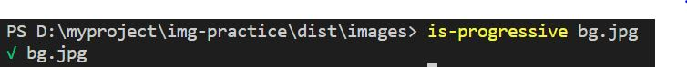
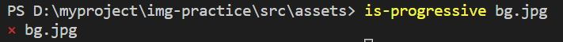
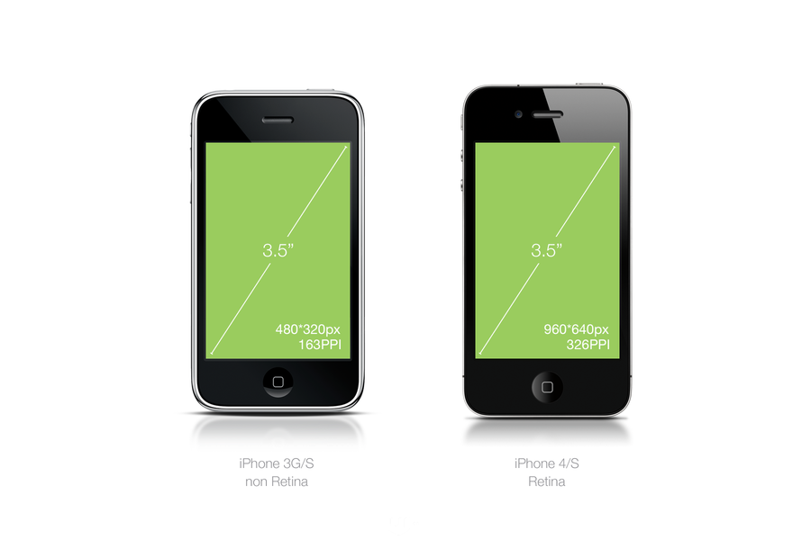

## 前端性能优化 --- 图片
> 网页所呈现的效果旨在用户更好的了解产品，为了展现一个炫酷的效果可能需要引入很多图片，但是在网络状况不佳的时候，由于加载过慢（等待让人，没错，我就是个baozao的人）， 还没有加载出完整页面的时候就被无情的关闭了。(此刻程序员内心os:再给我一秒钟...) 那么就有同学问啦，怎么样才能减少辛辛苦苦写出来的炫酷页面因为加载过慢被无情的关闭的可能性呢？这就涉及到前端性能优化的问题啦，前端性能优化涉及到的点很多，但是本文内容只关注图片优化部分，如果想要了解性能优化的其他方面，敬请关注后续文章。本文总结了图片优化的各种方法，下面就来详细介绍一下吧 

对于网页而言，图片资源主要是由于请求数量过多或者请求的字节数过大，占用带宽从而影响页面加载速度，那么我们可以从两个大方面来考虑图片： <kbd>减少请求字节数</kbd> <kbd>减少请求数量</kbd>

#### <center> == 减少请求字节数 == </center>

在进行下面的图片大小优化之前，我们首先需要思考一个问题：你真的需要图片吗？
> 首先你需要确认你是否真的需要用图片的形式来展现，如果能用样式实现的效果优先选择css来实现，毕竟几行css代码占用的资源大小是远小于图片的。

如果你的答案是肯定的，那么我们就一起来看看怎么优化图片吧，图片优化是一个渐进的过程，小编总结下来主要可以分为这几个步骤：首先根据使用场景选择合适的图片格式 >> 图片压缩 >> 响应式图片

1. 选择合适的图片格式
  > 既然选择了使用图片，那接下来就是为当前图片选择恰当的格式，每一种格式都有它的优缺点，不同的图片格式支持不同的功能，例如动画、透明度、缩放效果等，因此，需要将所需视觉效果与功能相结合来选择“正确的格式”。下面的表格中列举了几种常用的图片格式，可以根据使用场景自行挑选。

| 图片格式 | 压缩方式  | 透明度 | 动画   | 浏览器         | 适用场景                     |
| -------- | --------- | ------ | ------ | -------------- | ---------------------------- |
| JPEG     | 有损      | 不支持 | 不支持 | 所有           | 复杂颜色及形状               |
| PNG      | 无损      | 支持   | 不支持 | 所有           | 透明背景；logo               |
| GIF      | 无损      | 支持   | 支持   | 所有           | 动图                         |
| SVG      | 无损      | 支持   | 支持   | 所有           | 形状简单，需要良好缩放体验   |
| WebP     | 有损&无损 | 支持   | 支持   | 除了safari和IE | 复杂颜色及形状（浏览器支持） |

问：大的背景图（无透明部分）应该选择JPEG还是PNG?

答：JPEG! JPEG采用有损压缩，可以在不影响视觉效果的情况下，将图片压缩得更小（如下图所示，同一张图片在不影响视觉效果的情况下，jpg格式只有png格式的一半大小）


>顺便提一下有损压缩和无损压缩:
>有损压缩 -> 在压缩过程中丢弃掉一些像素信息(但是由于人眼的可分辨图片质量是有限的，就是就算丢弃了一些像素信息也看不出来==)，此过程不可逆；
>无损压缩 -> 在压缩过程中图片质量没有损耗，此过程可逆

问：一个简单图形，且有缩放需求，采用什么格式呢？

答：采用SVG，矢量图是由点、线、和简单图形构成的，能够在任何分辨率和缩放设置下呈现清晰的效果，因此这种格式最适用于高分辨率屏幕和需要以不同尺寸显示的情况。

问：什么时候使用WebP格式呢？

答：WebP格式相较于其他传统格式的有更高的压缩率，且能适应多种场景，但是由于是新格式，并不是所有浏览器都支持(<a href='https://caniuse.com/#search=WebP'>caniuse</a>上的查询WebP的浏览器支持率为80.87%）,可以使用如下代码安全的使用WebP格式
```html
<picture>
  <source type="image/webp" srcset="image.webp">
  
</picture>
```
1.1 基本型JPEG 和 渐进型JPEG
>小编在查看图片格式相关资料的时候，发现JPEG格式还分为两种类型：基本型（baseline-jpeg），渐进型（preogressive-jpeg）  
>先来看看这两者在展示上的区别(左边为基本型，右边为渐进型)


>从图中可以看到这两种类型的JPEG显示方式不同（与编码顺序有关）：
* 普通型的以从上往下（or从左往右）的顺序编码，所以在低速网络下，我们将首先看到图片的顶部，随着图片的加载，由上往下逐渐显示完整的图片
* 渐进式图片的首先会看到一张模糊的完整图片，随着图片的加载，逐渐显示出更加清晰的图片

编码原理什么咱就不说了（小编也不知道），但从显示方式来看，渐进式JPEG在大图显示上是很有优势的，在低速网络下，可以让用户先看到图片的大体，而不是等待图片一点一点的加载出来，会有一种加载更快的错觉==（实际上，大多数情况下渐进式确实加载更快），那么我们怎么判断是否是渐进式JPEG呢？如下，可以通过is-progressive，通过命令行的形式来判断是否为渐进式JPEG（生成渐进式JPEG的方法会在下文的图片压缩中提到）



2. 图片压缩
> 在上文中，我们已经选择好了合适的图片格式，为了达到减小图片大小的目的，下面我们开始介绍图片压缩，压缩图片自然是需要用到工具，本文中使用的工具是imagemin。

 首先我们需要安装imagemin,以及处理JPEG格式imagemin-mozjpeg和处理PNG格式的imagemin-pngquant
 ```javascript
 npm install imagemin
 npm install imagemin-mozjpeg
 npm install imagemin-pngquant
 ```
然后创建一个imagemin.js文件，并添加如下代码
```javascript
const imagemin = require('imagemin');
const imageminMozjpeg = require('imagemin-mozjpeg');
const imageminPngquant = require('imagemin-pngquant');

const JPEGImages = '../src/assets/*.jpg';
const PNGImages = '../src/assets/*.png';
const output = '../dist/images';

imagemin([JPEGImages, PNGImages], {
  destination: output,
  plugins: [
    imageminMozjpeg({
      quality: 70,
      progressive: true //生成渐进式jpeg
    }),
    imageminPngquant({ 
      quality: [0.65, 0.8] 
    })
  ]
});
```
通过上面的代码就可以批量压缩JPEG和PNG格式的图片了，其中quality用于控制压缩质量（注意：对于不同的图片，参数的值需要进行调整，要达到理想的效果需要测试不同的参数值），imagemin-mozjpeg中的progressive可以用于生成渐进式JPEG。还可以通过imagemin-webp生成WebP格式的图片，本文不做过多介绍，有兴趣的同学可以上<a href='https://www.npmjs.com'>npm</a>查询他们的使用方法以及更多参数介绍。

3. 响应式图片
  
上文中利用工具对图片大小进行了压缩，咱们离图片优化终极目标越来越近了，下面我们需要做的是：针对不同分辨率的屏幕响应式的提供<kbd>合适</kbd>的图片

怎样的图片才算是<kbd>合适</kbd>呢？首先我们来了解一下待会会涉及到的相关知识：
>**设备物理像素**：设备显示屏中使用的最小显示单元，也就是屏幕分辨率
>
>**设备独立像素/css像素**：web编程中的逻辑像素，也就是css像素
>
>**设备像素比(DPR)**:  js中可以用window.devicePixelRatio 获取当前设备的DPR，此属性表示当前显示设备的设备物理像素和设备独立像素的比值。（简单的说就是告诉浏览器用多少个物理像素来绘制一个css像素）
>
>**Retina显示屏**：所谓"Retina"是一种显示标准，是把更多的像素点压缩至一块屏幕里，从而达到更高的分辨率并提高屏幕显示的细腻程度，也被称为视网膜显示屏。


>如下图所示，在相同尺寸的屏幕大小下，Retina显示屏包含的更多像素，示例中的Retina设备在水平和垂直方向比普通设备多两倍的像素，这意味着过去容纳1个像素的空间，现在需要容纳4个像素了。那么多出来的像素，会尝试使用它们周围像素的数据，来判定它们应该显示什么颜色（颜色近似选取），于是，在普通设备上正常显示的图片在Retina设备上会给人一种模糊的感觉。



>解决方案通常是为Retina屏提供高分辨率的图片（比如提供分辨率为两倍@2x的图片）,于此同时我们还需要为普通屏幕提供正常分辨率的图片（@1x的图片）,否则就会造成图片像素的浪费。

那么怎么针对不同DPR的显示屏提供<kbd>合适</kbd>的图片呢？
>方案一：用@media媒体查询的方式，对于DPR>=2的显示屏提供@2x的图片
```css
.bg {
  background-image: url("bg.jpg");
  width: 100px;
  height: 100px;
  background-size: 100% 100%;
}
@media (-webkit-min-device-pixel-ratio: 2),(min-device-pixel-ratio: 2) {
  .bg {
      background-image: url("bg@2x.jpg")
  }
}
```
>方案二：使用srcset属性，当DPR为1时，采用@1x图片；DPR为2时，采用@2x图片，如果DPR没有命中1或者2时，则会选择最相近的DPR所对应的图片（如果浏览器不支持srcset属性则会用src中的图片进行显示）

```html

```

#### <center> == 减少请求数量 == </center>

减少请求数量的方法：
* 雪碧图 （不赘述）【不推荐使用，简述相关缺点，然后说说现在用了什么方法可以用来代替
* base64编码
  > 将图片转为base64编码，将编码写入HTML中，图片会随着HTML一起下载到本地
  * 适用于小图片，一般编码后大小会比原文件大小更大，若大图片转为base64会导致载体文件可读性差，数据量增大，加载过慢
* 内联svg（是什么，需查阅相关资料）
  > 如果 
* css实现效果
  > 能够用css实现的效果就用css来做，毕竟几行代码所占用的资源是远小于图片的
* 使用字体图标
  
>**总结**: 本文列举和分析了图片优化中的几种方法，不论是什么方法，其最主要的目的就是减少http请求和减小图片资源的大小。看完文章有没有想要回去优化网页的冲动！赶紧行动起来！